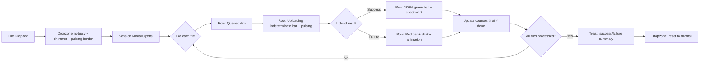

# Upload Feedback Interface Improvement Plan

## Problem

When a user drops a file onto any upload dropzone (VidHosting, Catbox, ImgBB, CtrlEm), the UI gives minimal feedback:
- Dropzone gets `is-busy` class → opacity 0.72 + cursor wait
- A session modal opens with text status per row ("Queued" → "Uploading" → "Uploaded"/"Failed")
- No progress indication, no animation, no sense of activity

Users perceive the page as "frozen" during uploads, especially for large files (videos to VidHosting, images to ImgBB).

## Design Goals

1. **Immediate visual feedback** on dropzone when file is accepted
2. **Animated progress** during upload (not just text changes)
3. **Per-file progress bar** in the session modal
4. **Smooth transitions** between states (queued → uploading → done/failed)
5. **Toast notifications** for quick success/failure feedback
6. **Upload speed / ETA** for large files (VidHosting 100MB+)

---

## Changes Overview

### 1. Dropzone Visual Feedback (`styles.ts`)

**New CSS classes to add:**

- `.ctrlem-db-upload-dropzone.is-busy` — enhanced with pulsing border animation
- `.ctrlem-db-upload-dropzone.is-busy::after` — shimmer overlay that sweeps across
- `.ctrlem-db-upload-session-row.is-uploading` — animated pulse on the row
- `.ctrlem-db-upload-session-row.is-uploaded` — green highlight with checkmark animation
- `.ctrlem-db-upload-session-row.is-failed` — red highlight with shake animation
- `.ctrlem-db-upload-progress-bar` — thin animated progress bar inside each row
- `.ctrlem-db-upload-progress-fill` — the fill portion with width transition
- `.ctrlem-db-upload-speed` — small text showing speed/ETA
- `@keyframes ctrlem-db-shimmer` — shimmer sweep animation
- `@keyframes ctrlem-db-pulse-border` — border pulse for busy state
- `@keyframes ctrlem-db-check-in` — checkmark appear animation
- `@keyframes ctrlem-db-shake` — error shake animation

### 2. Upload Session Modal Enhancements (`uploadPanel.ts`)

**`createUploadSession()` changes:**

Each session row currently has:
```
[filename] [status text] [detail: url/error]
```

Change to:
```
[filename] [progress bar + status text] [detail: url/error/speed]
```

**Per-row progress bar:**
- Add a `.ctrlem-db-upload-progress-bar` div inside each row
- For external uploads (ImgBB, Catbox, VidHosting), we can't track real progress via `fetch`/`GM_xmlhttpRequest`, so use **indeterminate animated bar** (striped animation)
- For CtrlEm native uploads, also use indeterminate since it's a simple POST
- The bar provides visual "something is happening" feedback even without byte-level progress

**Row status visual changes:**
- `STATUS.QUEUED` → dim, no bar, text "Queued"
- `STATUS.UPLOADING` → indeterminate bar animating, pulsing row, text "Uploading..."
- `STATUS.UPLOADED` → bar fills to 100% with green, checkmark icon, text "Uploaded"
- `STATUS.FAILED` → bar turns red, shake animation, text error in red

**Session status bar:**
- Add a small overall progress counter: "2 of 5 files uploaded"
- Animate transitions between status messages

### 3. Dropzone Upload Animation (`uploadPanel.ts`)

**`createExternalTool()` and `createNativeTool()` changes:**

When `setBusy(true)` is called:
- Dropzone gets `is-busy` class → pulsing border + shimmer overlay
- Upload icon SVG gets a spin animation
- Text changes from "Drag & drop image or browse" to "Uploading..."

When `setBusy(false)` is called:
- Brief success pulse (green border flash) before returning to normal
- If all failed, red border flash

### 4. Upload Speed / ETA (`uploadPanel.ts` + `contentUpload.ts`)

**For large file uploads (VidHosting, Catbox):**

Since `GM_xmlhttpRequest` and `fetch` don't provide upload progress events in all contexts, we implement a **time-based estimation**:

- Record `startTime` before upload
- Periodically (every 500ms) during upload, calculate elapsed time
- Display "Uploading... (X.X MB / Y.Y MB)" with estimated speed
- Use a polling approach: check `Date.now()` - `startTime` and update UI

This is done in the `uploadFiles` loop in `createExternalTool()`:
```typescript
const startTime = Date.now();
const updateInterval = setInterval(() => {
  const elapsed = ((Date.now() - startTime) / 1000).toFixed(1);
  session.setItemProgress(item, { 
    statusText: `Uploading... (${elapsed}s)`,
    speed: file.size > 1024 * 1024 
      ? `${(file.size / 1024 / 1024 / (elapsed || 1)).toFixed(1)} MB/s`
      : ''
  });
}, 500);
```

### 5. Toast Notifications (`uploadPanel.ts`)

After upload session completes:
- If all files succeeded → brief green toast "All files uploaded"
- If some failed → yellow toast "X of Y files failed"
- Toasts auto-dismiss after 3 seconds

Use existing toast infrastructure if available, or create simple inline toasts.

### 6. Upload Session Modal Layout Update

**Current layout:**
```
┌─────────────────────────────────────┐
│ [Title]              [Category ▼]   │
├─────────────────────────────────────┤
│ [filename]  [status]  [detail]      │
│ [filename]  [status]  [detail]      │
├─────────────────────────────────────┤
│ [status message]                    │
│ [Cancel]                    [Add]   │
└─────────────────────────────────────┘
```

**New layout:**
```
┌─────────────────────────────────────┐
│ [Title]              [Category ▼]   │
│ [progress: 2/5 files]              │
├─────────────────────────────────────┤
│ [filename]  [████████░░]  [status]  │
│ [filename]  [██████████]  [status]  │
│ [filename]  [░░░░░░░░░░]  [status]  │
├─────────────────────────────────────┤
│ [status message]                    │
│ [Cancel]                    [Add]   │
└─────────────────────────────────────┘
```

---

## Files to Modify

| File | Changes |
|------|---------|
| `src/ui/styles.ts` | Add ~150 lines of new CSS: animations, progress bar, shimmer, status transitions |
| `src/ui/uploadPanel.ts` | Add progress bar element to session rows, add speed/eta display, add indeterminate progress animation, enhance dropzone busy state, add toast notifications |
| `src/services/contentUpload.ts` | No changes needed (upload logic stays the same) |

---

## Implementation Order

1. **`styles.ts`** — Add all new CSS classes and keyframe animations
2. **`uploadPanel.ts`** — Enhance `createUploadSession()` with progress bars and animated states
3. **`uploadPanel.ts`** — Enhance `createExternalTool()` and `createNativeTool()` with better busy feedback
4. **`uploadPanel.ts`** — Add upload speed/ETA display
5. **`uploadPanel.ts`** — Add toast notifications on session completion
6. Run `npm run typecheck` and `npm run build` to verify

---

## Mermaid: Upload Flow with New Feedback



---

## Key Design Decisions

1. **Indeterminate progress bars** — Since we can't get real upload progress from `fetch`/`GM_xmlhttpRequest`, we use animated indeterminate bars that visually show activity without misleading the user with fake percentages.

2. **Time-based speed display** — Even without byte-level progress, showing elapsed time and calculated average speed gives the user a sense of progression.

3. **No changes to upload logic** — All changes are purely UI/UX. The upload functions in `contentUpload.ts` and `app.ts` remain untouched.

4. **CSS animations over JS animations** — For performance, all animations use CSS `@keyframes` and `transition`, keeping JS overhead minimal.